# Face Recognition Using Eigenfaces and Pattern Classification

> **UNIVERSITY OF GHANA**<br>
> *All rights reserved*
>
> **MPHIL/MSC DATA SCIENCE, SECOND SEMESTER EXAMINATIONS: 2025/2026**<br>
> **DSCD612: PATTERN RECOGNITION (3 CREDITS)**

## Examination coursework brief

This repository is the final-examination coursework submission for DSCD612.
The coursework consists of four independent practical projects; each student
selects and completes **one** project. This submission implements Project 3:
face recognition using eigenfaces and pattern classification.

The assessment objective is not merely high classification accuracy. It calls
for an understood and justified pattern-recognition pipeline, appropriate
algorithm implementation, scientific evaluation, and interpretation of the
findings. Each project should include:

1. Problem formulation and dataset description.
2. Exploratory analysis and appropriate preprocessing.
3. Feature representation and/or feature extraction.
4. Mathematical explanation of the principal algorithms employed.
5. Python implementation.
6. Appropriate experimental design, including training/test separation where classification is involved.
7. Quantitative evaluation and comparison of methods.
8. Visualization and interpretation of results.
9. Critical discussion of limitations.
10. A concise technical report accompanied by executable Jupyter Notebook/Python code.

---

DSCD612 Pattern Recognition, Project 3
Daniel Kpakpo Adotey · ID 22424924 · dkadotey@st.ug.edu.gh
MPhil/MSc Data Science, University of Ghana, Second Semester 2025/2026

## Contents

```
notebooks/eigenfaces_project.ipynb   main deliverable, runs top to bottom
notebooks/eigenfaces_project.py      same notebook in jupytext percent format
src/eigenfaces.py                    splitting, perturbation, metric and plotting helpers
report/report.tex                    technical report (LaTeX source)
report/report.pdf                    technical report (compiled, 7 pages)
report/results.json                  every reported number, written by the notebook
figures/                             all 15 figures, written by the notebook
data/olivetti_py3.pkz                Olivetti face database (1.3 MB), bundled
```

The dataset is included, so the notebook runs without network access.
`fetch_olivetti_faces` finds the cache in `data/` and loads it directly.

The PCA itself is implemented from scratch in the notebook, in the
`EigenfacePCA` class. scikit-learn is used for the k-NN classifier, the
evaluation metrics and as an independent check on the decomposition.

## Running

```
pip install -r requirements.txt
jupyter nbconvert --to notebook --execute --inplace notebooks/eigenfaces_project.ipynb
```

No internet connection is required. A full execution takes about 30 seconds
and recreates every figure in
`figures/` and every number in `report/results.json`. All splits are generated
from fixed seeds, so every accuracy in the report reproduces exactly; the two
wall-clock timings depend on the machine.

To rebuild the report:

```
cd report && pdflatex report.tex && pdflatex report.tex
```

Two passes resolve the figure and table cross-references. Figures are read from
`../figures/` via `\graphicspath`, so run it from inside `report/`. The build
needs no BibTeX; the bibliography is a `thebibliography` environment in the
source.

## Summary of findings

Roughly 99% of the 4096 pixel dimensions can be discarded without measurable
loss of identity information: 25 principal components match the accuracy of
1-NN on the full raw pixel space. Reconstruction error keeps improving well
past that point, so the conventional 95%-variance rule calls for about four
times more components than recognition needs. The leading eigenfaces encode
illumination rather than identity, and discarding them substantially improves
robustness to lighting change.

## Figures

All figures are written by the notebook to `figures/`, in the order they
appear there.

**Data**

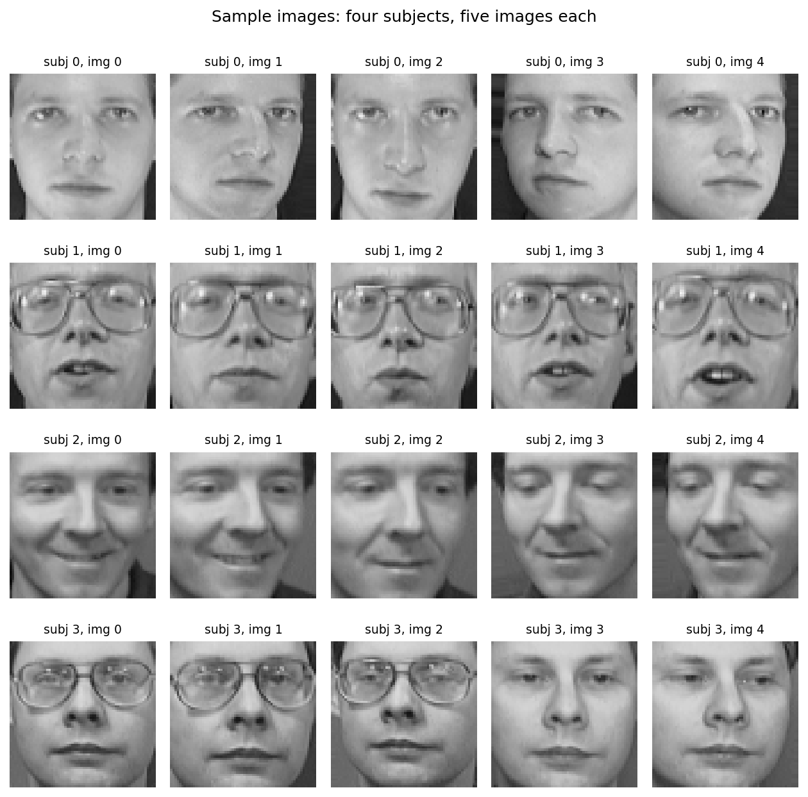
*Figure 1. Four subjects, five images each, showing the within-subject variation in lighting, expression and glasses.*

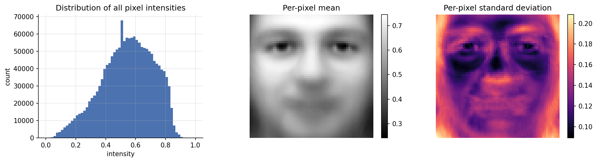
*Figure 2. Distribution of pixel intensities, and the per-pixel mean and standard deviation across all 400 images.*

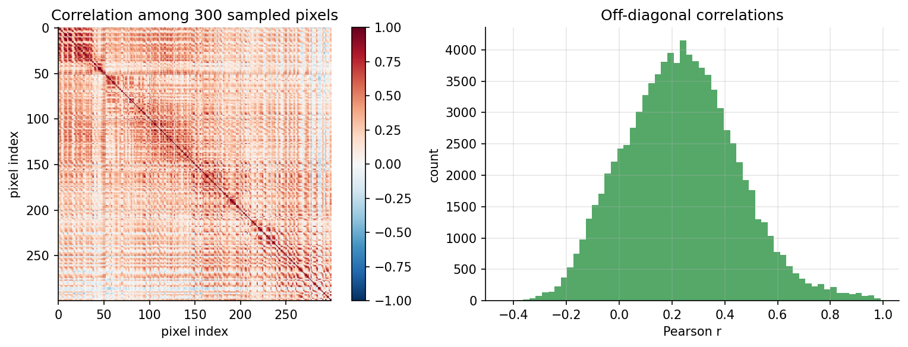
*Figure 3. Correlation matrix of 300 sampled pixels; mean absolute correlation 0.26.*

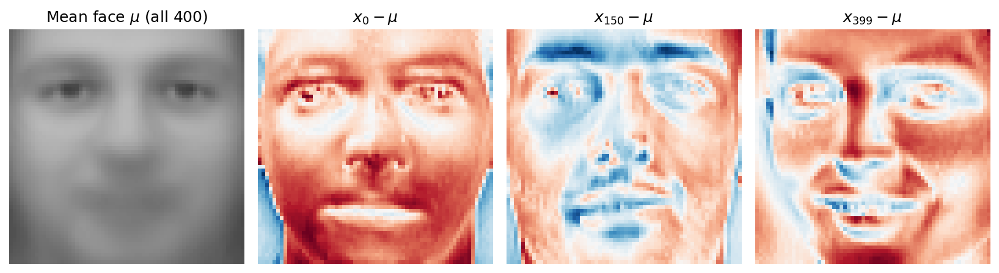
*Figure 4. The mean face over all 400 images and three mean-centred images.*

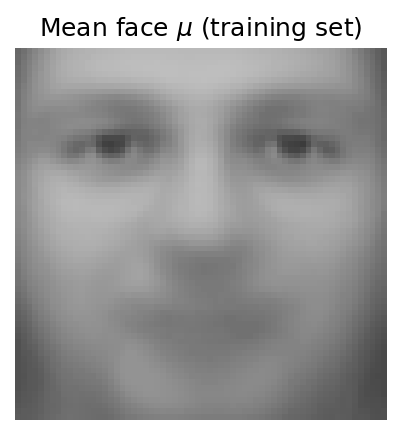
*Figure 5. The mean face estimated from the 280 training images only.*

**Eigenfaces**

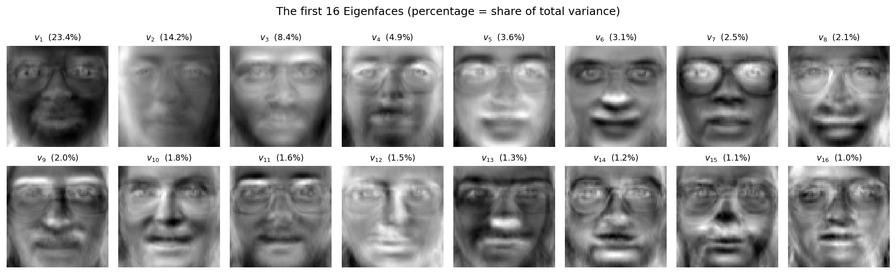
*Figure 6. The first 16 eigenfaces with the share of total variance for each.*

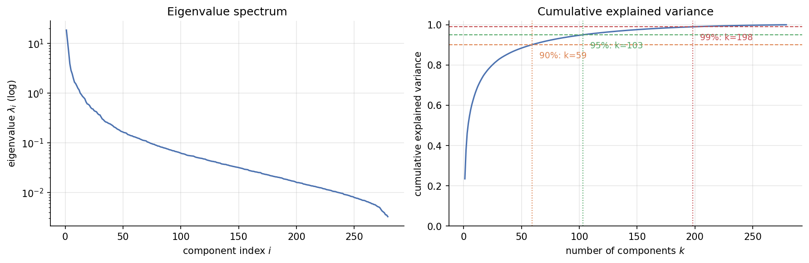
*Figure 7. Eigenvalue spectrum and cumulative explained variance; 59, 103 and 198 components reach 90%, 95% and 99%.*

**Recognition**

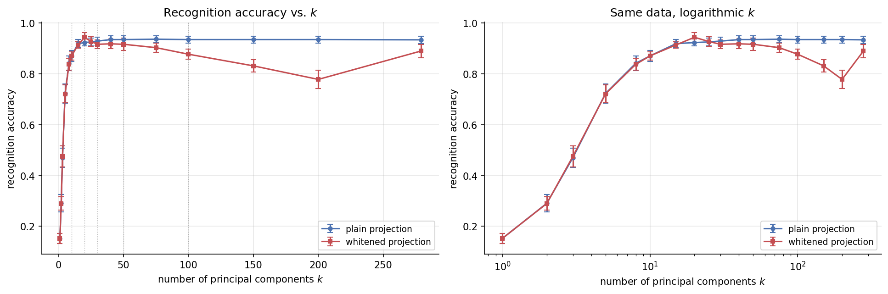
*Figure 8. Recognition accuracy against k for plain and whitened projections, mean and standard deviation over 10 splits.*

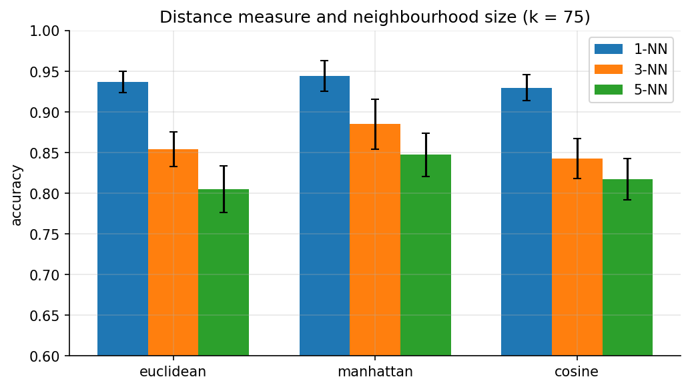
*Figure 9. Accuracy at k = 75 for Euclidean, Manhattan and cosine distance at 1, 3 and 5 neighbours.*

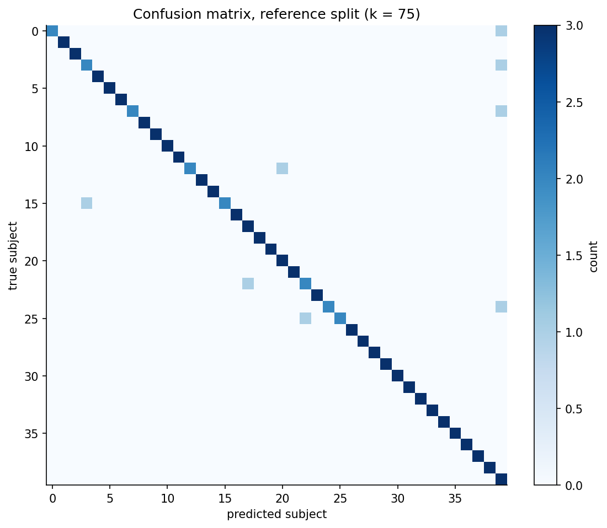
*Figure 10. Confusion matrix on the reference split, 8 errors in 120 test images.*

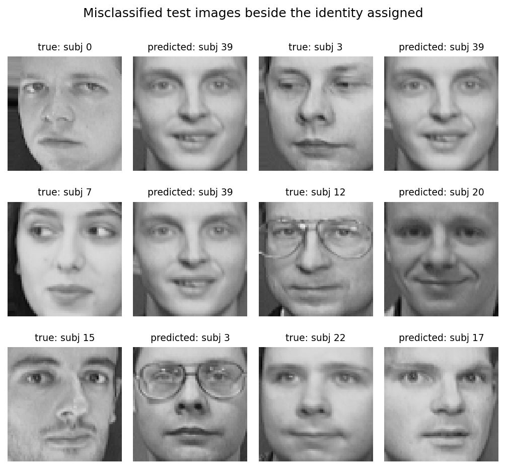
*Figure 11. Misclassified test faces beside a training image of the identity assigned to them.*

**Reconstruction**

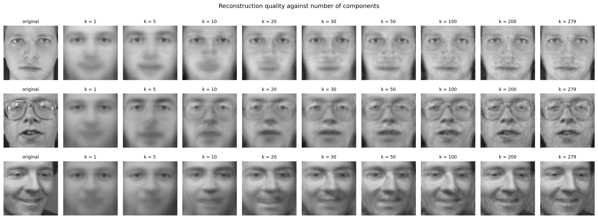
*Figure 12. Three test faces reconstructed at increasing k.*

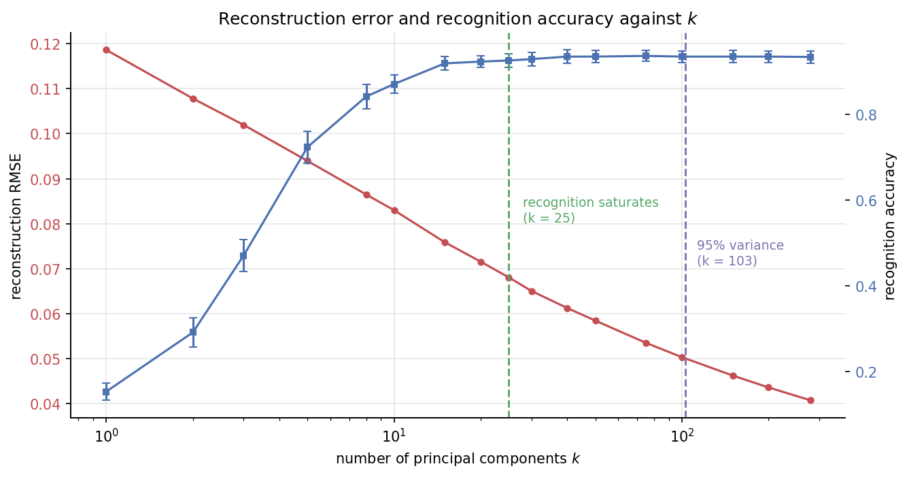
*Figure 13. Reconstruction error keeps falling after recognition accuracy has saturated.*

**Critical analysis**

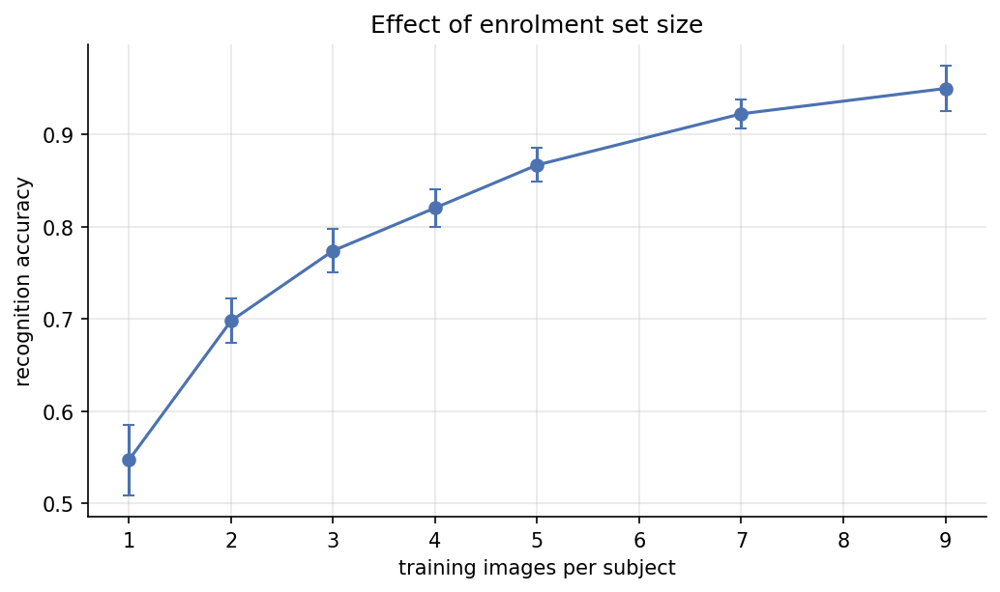
*Figure 14. Accuracy against the number of training images per subject, from 0.547 at one image to 0.950 at nine.*

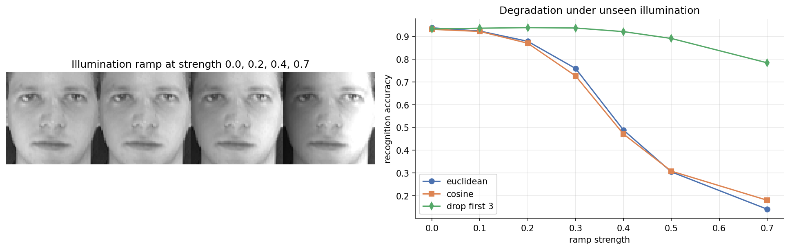
*Figure 15. Left, the intensity ramp at four strengths; right, accuracy under increasing illumination mismatch for Euclidean, cosine, and Euclidean with the first three components dropped.*
