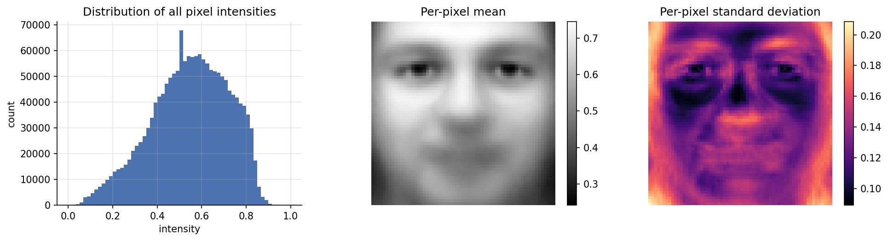
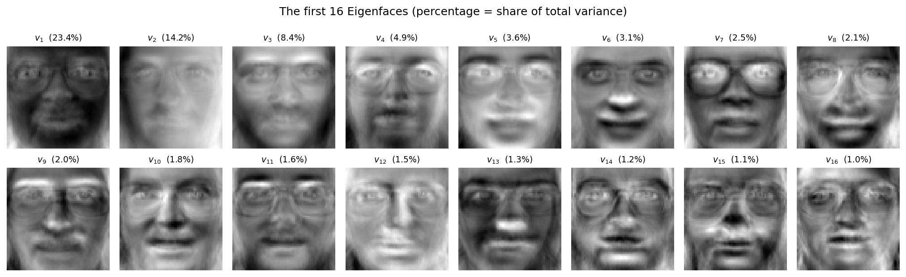
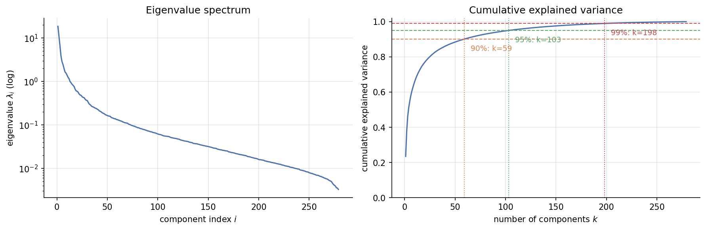
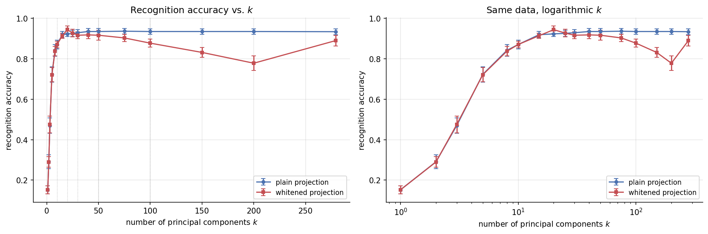
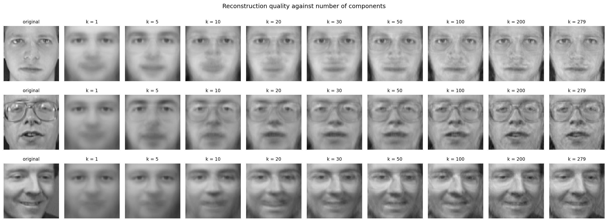
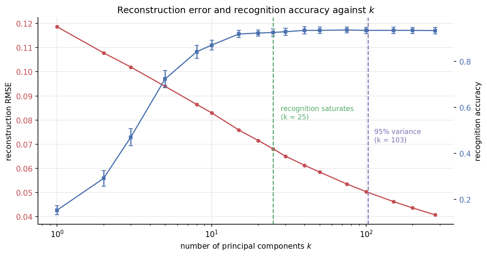
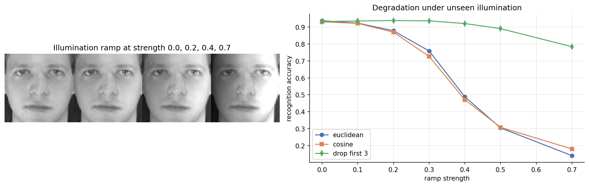

# Introduction and problem formulation

Face recognition, treated as closed-set identification, asks which of $C$
enrolled individuals a given face image depicts. Posed directly in pixel space
the problem is badly conditioned. A $64\times64$ greyscale image is a point in
$\mathbb{R}^{4096}$, and the dataset used here supplies 400 such points: there
are roughly ten times more features than observations. The sample covariance
matrix is singular by construction, nearest-neighbour distances concentrate,
and any per-class density estimate is hopeless.

What makes the problem tractable is that face images do not fill
$\mathbb{R}^{4096}$. They concentrate near a much lower-dimensional structure,
because faces share a common geometry. The *Eigenfaces* method of Turk and
Pentland [1] exploits this by finding the linear subspace capturing most of the
variation across a set of faces and performing recognition inside it.

This report implements that pipeline from first principles --- including the
principal component analysis itself, which is not delegated to a library --- and
uses it to answer the project's central research question:

> **How much dimensionality can be removed from facial images before
> identity-discriminating information is significantly lost?**

The question turns out to be sharper than it first appears, because
"information" admits two different measurements: *reconstruction*, how much
pixel variance is retained, and *discrimination*, how well identities can still
be told apart. The central empirical finding of this study is that these two
criteria disagree by roughly a factor of four, and that the disagreement has a
clear and explicable cause.

# Dataset

The **Olivetti (ORL) face database**, distributed with scikit-learn, contains
400 greyscale images of 40 subjects, ten images each, collected at AT&T
Laboratories Cambridge between 1992 and 1994. Images are $64\times64$ pixels,
supplied normalised to $[0,1]$.

Within a subject the ten images vary in lighting, facial expression (open or
closed eyes, smiling or not) and facial details (glasses or no glasses). All
were taken against a dark homogeneous background with the subject upright and
frontal. The faces are already cropped and roughly aligned, so this study
measures the recognition method rather than a face *detection* front end.

Exploratory analysis confirms the redundancy that motivates the method. The
per-pixel standard deviation map concentrates variance around the eyes,
hairline and jaw outline, and is low across the forehead, cheeks and
background. Among 300 randomly sampled pixels the mean absolute pairwise
correlation is $0.26$, and $10.4\%$ of pixel pairs exceed $|r| = 0.5$. The 4096
pixel features carry far less than 4096 features' worth of independent
information.

{width=100%}

# Method

## Principal component analysis

Let $A = X - \mathbf{1}\mu^{T}$ be the mean-centred data matrix, where
$\mu = \frac{1}{N}\sum_i x_i$. The sample covariance is

$$\Sigma = \frac{1}{N-1}\sum_{i=1}^{N}(x_i-\mu)(x_i-\mu)^{T} = \frac{1}{N-1}A^{T}A \in \mathbb{R}^{d\times d}.$$

PCA seeks the unit direction maximising projected variance $v^{T}\Sigma v$
subject to $v^{T}v = 1$. With a Lagrange multiplier,
$\mathcal{L} = v^{T}\Sigma v - \lambda(v^{T}v-1)$, and
$\partial\mathcal{L}/\partial v = 0$ gives the eigenvalue problem

$$\Sigma v_i = \lambda_i v_i .$$

The stationary points of the projected variance are exactly the eigenvectors of
$\Sigma$, and since $v_i^{T}\Sigma v_i = \lambda_i$, each eigenvalue *is* the
variance captured along its direction. Retaining the top $k$ eigenvectors as
columns of $W_k$ gives the rank-$k$ subspace minimising expected squared
reconstruction error (Eckart--Young). Because $\Sigma$ is real symmetric, the
eigenvectors are orthogonal and $W_k^{T}W_k = I_k$.

## The snapshot trick

$\Sigma$ is $4096\times4096$ and eigendecomposing it costs $O(d^3)$. It is also
guaranteed singular: it is a sum of $N_{\text{train}}$ rank-one terms subject to
one linear constraint, so $\operatorname{rank}(\Sigma) \le N_{\text{train}}-1 =
279$. At most 279 of its 4096 eigenvalues are non-zero.

Consider instead the Gram matrix $G = \frac{1}{N-1}AA^{T} \in
\mathbb{R}^{N\times N}$. If $Gu_i = \lambda_i u_i$, left-multiplying by $A^{T}$
gives

$$\frac{1}{N-1}A^{T}AA^{T}u_i = \lambda_i A^{T}u_i \iff \Sigma\,(A^{T}u_i) = \lambda_i\,(A^{T}u_i),$$

so $A^{T}u_i$ is an eigenvector of $\Sigma$ with the *same* eigenvalue. The
non-zero spectrum of a $4096\times4096$ matrix is obtained from a
$280\times280$ eigenproblem. Measured directly, this reduces fitting time from
$12.8$ s to $0.020$ s, a **626-fold speed-up**. The resulting vectors are
normalised to unit length.

## Why the eigenvectors are Eigenfaces

Each $v_i$ lies in $\mathbb{R}^{4096}$ --- the same space as the images --- so it
can be reshaped to $64\times64$ and displayed. What it displays is a *pattern of
deviation from the mean face*. Because it is a linear combination of the
training faces, $v_i \propto A^{T}u_i = \sum_j u_{ij}(x_j-\mu)$, it inherits
their face-like spatial structure. Every face is then written as

$$x \approx \mu + \sum_{j=1}^{k} z_j v_j, \qquad z = W_k^{T}(x-\mu),$$

an identity-specific recipe of $k$ coefficients over a shared basis of
face-shaped ingredients.

## Classification

A test face is projected to $z = W_k^{T}(x-\mu)$ and classified by
$k$-nearest neighbours. The choice of a non-parametric rule is deliberate: with
40 classes and 7 training images each, no parametric class-conditional density
is estimable --- a full Gaussian per class would require $k + k(k+1)/2$
parameters from 7 observations. Because $W_k$ is orthonormal, distances in the
projected space equal distances between the reconstructions in pixel space.

Two variants are compared: **plain** projection, in which components keep their
natural scale so high-variance directions dominate; and **whitened**
projection, $\tilde z_j = z_j/\sqrt{\lambda_j}$, which rescales every component
to unit variance and is equivalent to a Mahalanobis distance restricted to the
retained subspace.

## Correctness verification

The from-scratch implementation was checked against scikit-learn's `PCA` with
the exact (`full` SVD) solver. Maximum relative eigenvalue error was
$5.0\times10^{-15}$, the minimum absolute dot product between corresponding
eigenvectors was $1.0000000000$, and the maximum reconstruction difference was
$1.6\times10^{-14}$. The implementations agree to machine precision.

# Experimental design

Three decisions govern every number reported below.

**Subject-stratified splitting.** Each subject contributes $n_{\text{train}}$
images to training and the rest to test. A uniformly random split would leave
some subjects with no training images, making them unidentifiable by
construction. The default is 7 train / 3 test per subject:
$N_{\text{train}}=280$, $N_{\text{test}}=120$.

**PCA fitted on training data only.** $\mu$ and $W$ are estimated from training
images; test images are projected with those fixed parameters. Fitting PCA on
all 400 images before splitting is a real form of information leakage and
inflates reported accuracy.

**Repetition over splits.** With 120 test images a single split has a standard
error near 2.4 percentage points. Every result below is averaged over **10**
independent splits and reported with its standard deviation.

# Results

## Eigenfaces and the variance spectrum

{width=100%}

The first three components are low in spatial frequency and describe
whole-image photometric structure rather than facial detail: $v_1$ is a broad
contrast pattern separating the brow and eye band from the rest of the face,
$v_2$ is nearly flat and encodes overall luminance, and $v_3$ carries a
top-to-bottom intensity gradient. None describes who the person is. From $v_4$
onwards recognisable structure appears --- spectacle frames, hairline,
moustaches, changes around the mouth. Later components become progressively
more localised and higher in frequency, carrying identity information but also
sampling noise specific to the particular training images.

The variance thresholds requested by the brief are:

| Variance retained | Components required | Share of original 4096 dimensions |
|---|---|---|
| 90% | 59 | 1.44% |
| 95% | 103 | 2.51% |
| 99% | 198 | 4.83% |

The first component alone accounts for 23.4% of total variance and the first
ten for 66.1%.

{width=100%}

## Recognition accuracy against the number of components

{width=100%}

| $k$ | Plain | Whitened | $k$ | Plain | Whitened |
|---|---|---|---|---|---|
| 10 | 0.871 ± 0.021 | 0.871 ± 0.017 | 50 | 0.935 ± 0.015 | 0.917 ± 0.025 |
| 15 | 0.919 ± 0.016 | 0.914 ± 0.013 | 75 | **0.937** ± 0.013 | 0.903 ± 0.018 |
| 20 | 0.923 ± 0.014 | **0.944** ± 0.019 | 100 | 0.935 ± 0.013 | 0.878 ± 0.020 |
| 25 | 0.926 ± 0.016 | 0.928 ± 0.020 | 150 | 0.935 ± 0.014 | 0.832 ± 0.024 |
| 30 | 0.929 ± 0.016 | 0.917 ± 0.017 | 200 | 0.935 ± 0.013 | 0.778 ± 0.036 |
| 40 | 0.935 ± 0.016 | 0.918 ± 0.019 | 279 | 0.934 ± 0.014 | 0.890 ± 0.026 |

The two curves behave quite differently, and the contrast is the clearest
result in this study.

**The plain curve rises and then flattens; it does not fall.** This follows
from the geometry rather than from the dataset. $W$ is orthonormal, so with all
components retained the Euclidean distance in Eigenface space equals the
distance in pixel space exactly. Adding components therefore moves 1-NN
monotonically towards the full-dimensional solution and cannot diverge from it.
Trailing components have tiny eigenvalues and contribute almost nothing to a
Euclidean distance. Under this metric the cost of keeping too many components
is computational, not statistical.

**The whitened curve rises, peaks at $k=20$, then falls substantially** --- from
$0.944$ to $0.778$ at $k=200$. Whitening divides component $j$ by
$\sqrt{\lambda_j}$, which for a trailing component means division by a very
small number, promoting it to equal footing with the leading ones. But the
$i$-th eigenvalue is estimated from only 280 observations in 4096 dimensions;
for large $i$ the estimate is dominated by sampling noise, and the direction
describes idiosyncrasies of the particular training images rather than a
property of the population. Whitening amplifies exactly that noise into the
distance computation, producing the classical overfitting signature.

The general principle behind both curves is that **the useful number of
components is set by how many directions can be estimated reliably from the
available sample, not by how many are mathematically available.** Whether the
unreliable ones do harm depends on whether the metric gives them weight ---
which is why the two curves diverge. "How many components should I keep?"
therefore has no representation-only answer; it is a joint property of the
representation and the classifier that consumes it.

## Classifier evaluation

Two operating points are carried forward: $k_{\text{peak}} = 75$, maximising
mean accuracy, and $k_{\text{parsimonious}} = 25$, the smallest $k$ within one
standard deviation of the peak.

At $k = 75$, averaged over 10 splits with 1-NN and Euclidean distance:

| Metric | Mean | s.d. |
|---|---|---|
| Accuracy | 0.9367 | 0.0137 |
| Precision (macro) | 0.9507 | 0.0122 |
| Recall (macro) | 0.9367 | 0.0137 |
| $F_1$ (macro) | 0.9339 | 0.0148 |

Macro-averaging weights every subject equally, so a method failing on a handful
of individuals cannot hide behind good average behaviour.

**Distance measures.** Three were compared. Euclidean distance squares
per-component differences, so one badly disturbed component can dominate;
Manhattan distance weights components linearly and is more tolerant of a few
large deviations; cosine distance discards $\|z\|$ and compares direction only.

| Distance | 1-NN | 3-NN | 5-NN |
|---|---|---|---|
| Euclidean | 0.9367 | 0.8542 | 0.8050 |
| Manhattan | **0.9442** | 0.8850 | 0.8475 |
| Cosine | 0.9300 | 0.8425 | 0.8175 |

Manhattan is best at every neighbourhood size, consistent with the argument
above, though the margin over Euclidean is well under one standard deviation
and so is a weak preference rather than a finding. The dominant effect is not
the distance function but the **neighbourhood size**: accuracy falls sharply as
$n$ increases. With only 7 training images per subject, a 5-NN vote must reach
beyond the correct identity's images in a large fraction of cases. Each subject
occupies a tight cluster, and enlarging the neighbourhood necessarily crosses
into neighbouring identities. The usual argument that larger $n$ smooths noise
assumes a sample density this problem does not have.

**Confusion structure.** On the reference split, 8 of 120 test images are
misclassified and the confusion matrix is almost entirely diagonal. No pair of
subjects is *mutually* confused. The errors are not uniformly scattered either:
subject 39 absorbs half of them, drawn from four different true identities.
With only eight errors this is suggestive rather than established.

## Reconstruction

Reconstruction maps a projection back to pixel space by $\hat x = \mu + W_k z =
\mu + W_kW_k^{T}(x-\mu)$. Since $W_kW_k^{T}$ is an orthogonal projector, the
residual lies entirely in the discarded directions and
$\mathbb{E}\|x-\hat x\|^2 = \sum_{j>k}\lambda_j$.

{width=100%}

At $k=1$ every face is essentially the mean face with a photometric adjustment.
Identity becomes visually recognisable around $k = 20$ to $30$. Beyond
$k \approx 100$ changes are confined to fine texture. Quantitatively, test-set
RMSE falls from $0.083$ at $k=10$ to $0.050$ at $k=100$ and $0.041$ at $k=279$
(PSNR $21.8$, $26.2$ and $28.1$ dB respectively).

## The two criteria diverge

{width=90%}

This figure answers the research question directly. Reconstruction error keeps
falling well past the point where recognition accuracy stops improving, because
the residual variance removed in that range --- fine skin texture, sensor noise,
small expression detail --- contributes to pixel fidelity but not to telling
people apart. Retaining 95% of variance costs roughly **four times** as many
components as recognition needs ($k=103$ against $k=25$) and buys about one
accuracy point, which is inside the split-to-split noise.

This is why a variance threshold is the wrong criterion for choosing $k$ in a
recognition system. Such thresholds measure how well the subspace reproduces
images; recognition needs it to *separate identities*.

# Critical analysis

## Enrolment set size

| Images per subject | 1 | 2 | 3 | 4 | 5 | 7 | 9 |
|---|---|---|---|---|---|---|---|
| Accuracy | 0.547 | 0.698 | 0.774 | 0.820 | 0.867 | 0.923 | 0.950 |
| s.d. | 0.038 | 0.024 | 0.024 | 0.021 | 0.019 | 0.015 | 0.025 |

Accuracy rises steeply and has not saturated at nine images. Two mechanisms
operate. First, with few images per subject the classifier has few reference
points, so a test image showing an unseen expression has no near neighbour of
the correct identity. Second, the eigenface basis itself degrades: at
$n_{\text{tr}}=1$ only 39 components exist at all, estimated from 40 images, so
the subspace is both smaller and noisier. The 40-percentage-point drop from
nine images to one illustrates why the "one sample per person" problem remains
difficult. This is the strongest single influence on accuracy measured here.

## Illumination change

Test images were multiplied by a left-to-right linear intensity ramp of
increasing strength, modelling a directional light source absent at enrolment.
Training images were left untouched.

{width=100%}

| Ramp strength | 0.0 | 0.2 | 0.3 | 0.4 | 0.5 | 0.7 |
|---|---|---|---|---|---|---|
| Euclidean | 0.937 | 0.878 | 0.758 | 0.488 | 0.305 | 0.142 |
| Cosine | 0.930 | 0.869 | 0.726 | 0.471 | 0.308 | 0.181 |
| Drop first 3 | 0.932 | **0.938** | **0.936** | **0.920** | **0.890** | **0.783** |

Euclidean 1-NN collapses. Two mitigations were tested and only one works.

**Cosine distance does not help.** It tracks the Euclidean result at every ramp
strength. The prediction that it would help assumed a *uniform* brightness
change, which shifts a projection mainly in magnitude. The ramp used here is
spatially varying --- it brightens one side of the face and darkens the other ---
which *rotates* the projection rather than merely lengthening it, so discarding
magnitude discards nothing relevant. This is a useful negative result:
invariance to global scaling buys very little against lighting with spatial
structure, which real lighting always has.

**Discarding the first three components works dramatically.** At the strongest
ramp, Euclidean 1-NN falls to $0.142$ while the same classifier without those
three components holds $0.783$. Those three directions absorb almost the entire
effect of the perturbation. This is direct experimental evidence for the
interpretation offered on visual grounds in Section 5.1: the leading eigenfaces
encode photometric conditions, not identity. Discarding the three directions
carrying the largest share of total variance in the whole dataset substantially
*improves* recognition under illumination change. Variance ranking and
discriminative value are not merely different --- at the top of the spectrum they
can be actively opposed.

Under *matched* illumination, dropping up to three components changes accuracy
by less than one standard deviation in either direction, and dropping more than
about five begins to cost real accuracy. Note the magnitude involved: removing
three components discards 46% of total variance and leaves recognition
essentially unchanged. Discarding leading components is therefore a
*robustness* measure --- insurance that pays when test conditions differ from
enrolment conditions and costs little when they do not.

# Answering the central research question

A baseline is required: 1-NN on the raw 4096 pixels, with no reduction at all,
achieves $0.9342 \pm 0.0142$.

| Criterion | $k$ | Accuracy | Dimensions removed | Variance retained |
|---|---|---|---|---|
| Matches peak | 75 | 0.937 | 98.17% | 92.4% |
| Within 1% of peak | 30 | 0.929 | 99.27% | 82.7% |
| Within 5% of peak | 15 | 0.919 | 99.63% | 72.7% |

On this dataset roughly **99% of the original dimensions can be discarded with
no measurable loss of identity information**. At $k=25$ the Eigenface
representation scores $0.9258 \pm 0.0160$ against the raw-pixel baseline's
$0.9342 \pm 0.0142$ --- nominally a shade lower, by well under the split-to-split
noise, so the two are not distinguishable at this sample size. The correct
statement is that the 164-fold compression is *free*, not that it is
beneficial.

The computational claim deserves equal care. Measured end-to-end the Eigenface
pipeline is *slower* than raw 1-NN ($17.8$ ms against $3.5$ ms), because it
includes fitting PCA on every split. The reduction pays for itself at query
time and at scale --- each comparison costs 25 multiplications instead of 4096,
and the stored gallery shrinks by the same factor --- but on 400 images that
saving does not repay the one-off cost of the decomposition.

Three qualifications keep the headline honest:

1. **The bound is set by sample size, not by faces.** The training set admits at
   most $N_{\text{train}}-1 = 279$ components, so achievable compression is
   bounded by how many images were available, not by any intrinsic
   dimensionality of human faces.
2. **The threshold depends on the criterion.** Under reconstruction the answer
   is several times larger. "Information" must be defined before the question
   has a number attached to it.
3. **The threshold depends on operating conditions.** Every figure above comes
   from images captured under conditions similar to training. A compression
   lossless for identity under matched conditions is not necessarily lossless
   under mismatched ones.

# Limitations

**The dataset is easy relative to the deployed problem.** ORL faces are
pre-cropped, frontal, aligned, uniformly sized and captured against a constant
background in one laboratory. There is no background clutter, occlusion or age
variation, and no face *detection* or alignment stage was required --- in real
systems alignment error is often the dominant failure source.

**PCA is unsupervised and not optimised for this task.** It maximises total
variance without reference to labels, which is why the leading components
encode illumination. Fisherfaces (LDA after a PCA step) explicitly maximises
between-class to within-class scatter and typically outperforms Eigenfaces
under lighting variation. That comparison was not implemented, so the claim
that PCA is suboptimal here rests on the observed component structure and the
illumination experiment, not on a direct measurement.

**The model is linear.** Pose and expression changes move a face along a curved
manifold, which a linear subspace can only approximate; reconstructions at
$k=279$ are still not exact.

**Scale is small.** Even averaged over ten splits the standard deviation at the
operating point is about 1.5 percentage points, so differences of a point or
two have not been interpreted as real. Accuracy also falls as the enrolled
gallery grows, so these figures would not transfer to thousands of identities.

**The illumination model is synthetic.** The ramp is a multiplicative
approximation of directional lighting; it does not reproduce cast shadows,
specularities or saturation, all non-linear effects likely to degrade
performance further.

**Closed-set assumption.** Every test image belongs to an enrolled subject, and
nearest-neighbour classification always returns some identity. A deployed
system needs a distance threshold for rejecting unknown people, and calibrating
it is a separate problem not addressed here.

# Conclusions

1. PCA implemented via the snapshot trick recovers the eigenfaces from a
   $280\times280$ eigenproblem rather than a $4096\times4096$ one, a 626-fold
   speed-up, matching a reference implementation to machine precision.
2. The leading eigenfaces encode photometric conditions rather than identity ---
   a direct consequence of ranking directions by variance, and confirmed
   experimentally by the illumination perturbation.
3. Recognition accuracy saturates at a few tens of components while
   reconstruction error keeps falling. The conventional 95% variance threshold
   calls for roughly four times as many components as recognition needs.
4. Retaining more components does not necessarily improve generalisation, and
   whether it hurts depends on the classifier's metric: under plain Euclidean
   1-NN accuracy plateaus, whereas under a whitened metric it degrades clearly
   as noise-dominated components are amplified.
5. Enrolment set size is the strongest single influence on accuracy, falling
   about 40 percentage points between nine training images per subject and one.
6. Unseen illumination is the most damaging perturbation tested, and the
   effective remedy is to discard leading components rather than to change the
   distance measure. Cosine distance, often recommended for this purpose, gave
   no benefit against spatially varying lighting.

# Reproducibility

All results are produced by `notebooks/eigenfaces_project.ipynb`, which runs
top to bottom without manual intervention and writes every figure in
`figures/` and every number in `report/results.json`. Splits are generated from
fixed seeds, so reported values are reproducible exactly.

# References

[1] M. Turk and A. Pentland, "Eigenfaces for Recognition," *Journal of
Cognitive Neuroscience*, vol. 3, no. 1, pp. 71--86, 1991.

[2] F. Samaria and A. Harter, "Parameterisation of a Stochastic Model for Human
Face Identification," *Proceedings of the 2nd IEEE Workshop on Applications of
Computer Vision*, Sarasota FL, 1994. (ORL database.)

[3] P. Belhumeur, J. Hespanha and D. Kriegman, "Eigenfaces vs. Fisherfaces:
Recognition Using Class Specific Linear Projection," *IEEE Transactions on
Pattern Analysis and Machine Intelligence*, vol. 19, no. 7, pp. 711--720, 1997.

[4] C. Eckart and G. Young, "The approximation of one matrix by another of
lower rank," *Psychometrika*, vol. 1, no. 3, pp. 211--218, 1936.

[5] R. O. Duda, P. E. Hart and D. G. Stork, *Pattern Classification*, 2nd ed.,
Wiley, 2001.
